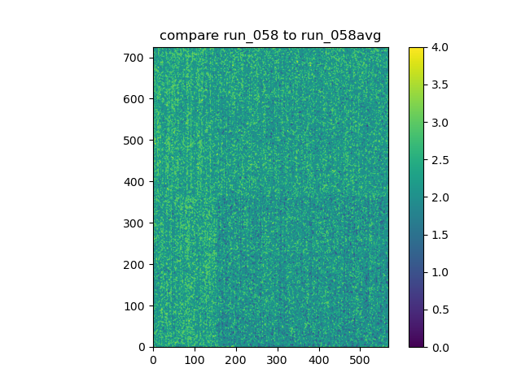
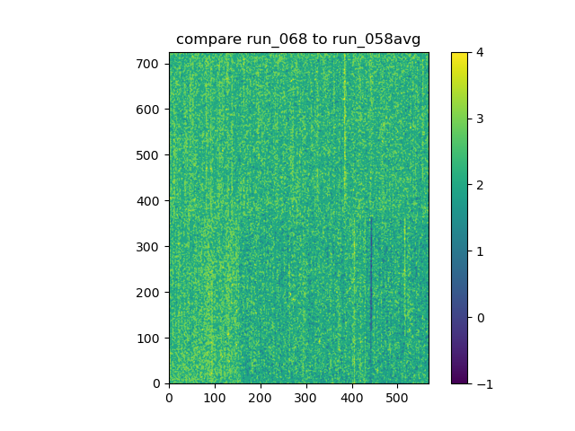

For LCLS-1 data processing, from the root directory (`CookieBox_pkg`)

# Dark Images
```bash
source init.bash
python3 python/Xtcav_store_dark.py amo86815 58 62 68
```

  
Comparing an individual block average image to the run average (mean of block averages) in fun 58.  


  
Comparing a block average in run 68 with the whole run average (mean of block averages) in run 58.  

This indicates that the camera baseline indeed changes over the course of runs at best, and over the course of shots within a run at worst.  
